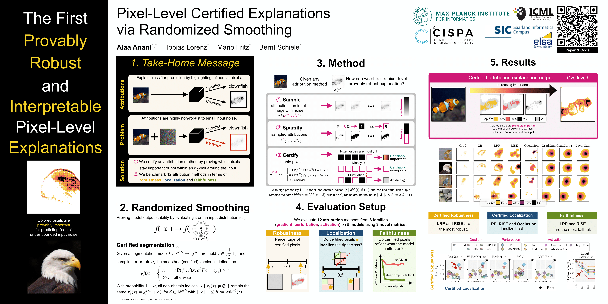
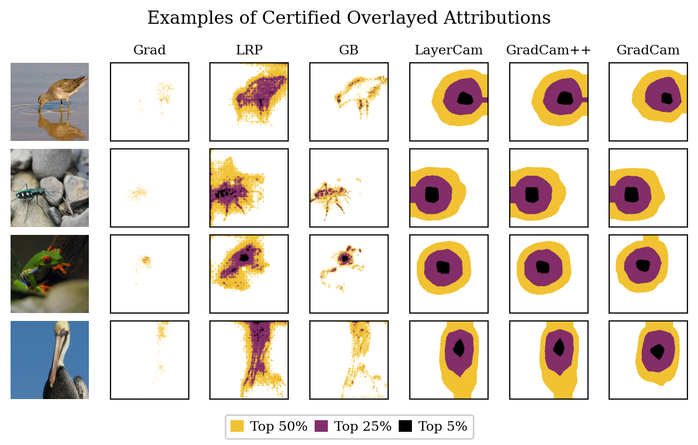

# Pixel-level Certified Explanations via Randomized Smoothing 

[OpenReview PDF](https://openreview.net/pdf?id=NngoETL9IK) | [arXiv](https://arxiv.org/abs/2506.15499) | [Poster](https://icml.cc/media/PosterPDFs/ICML%202025/45484.png?t=1752244525.7101903) | [Code](https://github.com/AlaaAnani/certified-attributions)

Code for the paper: 

Alaa Anani, Tobias Lorenz, Mario Fritz and Bernt Schiele. Pixel-level Certified Explanations via Randomized Smoothing. In _International Conference on Machine Learning (ICML)_, 2025. 

# Overview 

<figure>
  
</figure>

# Setup

## 1. Create conda environment with python 3.7

```bash
conda create -n cert_attr python=3.7
conda activate cert_attr
```

## 2. Install the package "attribution_certification"

```bash
pip install .
```

# Dataset

## 1. Convert ImageNet to tensors

First specify the following parameters

```python
IMAGENET_IMAGES_PATH="" # Set path to ImageNet validation images here
IMAGENET_LABELS_FILE="" # Set path to text file containing ImageNet validation labels here, with each line containing space separated image file name and label ID
```

Run the script to convert ImageNet images to PyTorch tensors

```bash
python scripts/convert_imagenet_to_tensors.py --images_path $IMAGENET_IMAGES_PATH --labels_path $IMAGENET_LABELS_FILE --save_path data/imagenet
```

✅ **Expected output:** The file `test.pt` in the directory `data/imagenet`

## 2. Generate the grid dataset

```bash
python scripts/generate_grid_dataset.py --dataset_path data/imagenet --scale 2 --save_path data/imagenet_grid_2x2 --num_test_images 500 --conf_threshold 0.99 --models vgg11 resnet18 --cuda
```

The previous args filter the dataset to only include images classified with confidence >=0.99 by models `VGG11` and `ResNet-18`.

✅ **Expected output:** The file `test.pt` in the directory `data/imagenet_grid_2x2`

# Quick Demo 1
This section explains how to generate the following certified attributions for any attribution method using our framework. 

✅ **Expected Output**


## Step 1: Run `scripts/certified_attribution.py`

You can run the certification script for **LRP** on the **Input** layer using the **ResNet-18** model through the following command:

```bash
python scripts/certified_attribution.py \
    --mode certify \
    --exp LRP \
    --layer Input \
    --dataset_path data/imagenet \
    --sigma 0.15 \
    --n 100 \
    --tau 0.75 \
    --model resnet18 \
    --save_dir outputs
    --num_images 100 \
```
✅ **Expected outputs**: Generating the following cached tensors:
- `outputs/certified/images_0.15_Input_LRP_resnet18_[50, 25, 5]_100_0.75_certified.pt`

If you wish to generate the certified attribution for different methods, re-run the script with a new `--exp` method value and adjust `--layer` accordingly.

### Key arguments

| Argument         | Description |
|------------------|-------------|
| `--mode`         | Mode of operation: "cache_samples" to generate and save noisy samples, "certify" to compute certified attributions directly without caching |
| `--exp`          | The attribution method (e.g., `Grad`, `GB`, `IxG`, `IntGrad`, `LRP`, `RISE`, `Occlusion`, `Cam`, `GradCam`, `GradCamPlusPlus`, `AblationCam`, `LayerCam`) |
| `--layer`        | Which layer to explain (e.g., `Input` or `Final`) |
| `--dataset_path` | Path to the tensor dataset created in **Dataset Setup** section (e.g., `data/imagenet` for images, `data/imagenet_grid_2x2` for grids) |
| `--sigma`        | The standard deviation for the isotropic Gaussian noise (e.g., `0.15`, `0.25`, `0.33`) |
| `--n`            | Number of noisy samples to generate per image (e.g., `100`) |
| `--model`        | The model architecture (`resnet18`, `resnet50_2`, `resnet152`, `vgg11`, `vit_b_16`) |
| `--save_dir`     | Noisy samples output location. (e.g., `outputs/`) |
| `--num_images`   | Number of test images to process (Default: `100`) |

Alternatively, you can specify these arguments in a config file `configs/imagenet/imagenet.yaml`.
## Step 2: Run demo.ipynb
This notebook seamelessly loads the generated certified tensors in `outputs/certified` for all methods and plots them into the figure in Demo 1.


# Quick Demo 2: 🔍 Step-by-step Scalable Certified Attributions

This section explains how to generate certified attributions, but in a scalable way. 
The process involves (1) sampling attribution maps under Gaussian noise, (2) efficiently caching the results, (3) efficiently loading them to certify and visualize under different parameters without needing to re-sample again.

✅ **Expected Output**

In `figures/figure2.png`:


## Step 1: Sample and Cache Attributions Under Gaussian Noise

To generate certified attribution maps, we first need to sample the model's attributions under Gaussian input perturbations. 

You can run the sampling script for **LRP** on the **Input** layer using the **ResNet-18** model through the following command:

```bash
python scripts/certified_attribution.py \
    --mode cache_samples # notice that now we only cache the noisy samples (without certification), since we will use them to certify later
    --exp LRP \
    --layer Input \
    --dataset_path data/imagenet \
    --sigma 0.15 \
    --n 100 \
    --model resnet18 \
    --save_dir outputs
    --num_images 200 \
```

✅ **Expected outputs**: Generating the following cached tensors:

- `outputs/noisy_samples_chunks/images/sigma_0.15/Input/LRP/<chunk_id>_raw_resnet18.pt`
  
- `outputs/noisy_samples_chunks/images/sigma_0.15/Input/LRP/<chunk_id>_noisy_samples_resnet18.pt`
  
With `<chunk_id>` spanning values `001 to 040`. 
  
#### ➤ Skip to Step 2 if you want to read later

#### 💾 Cached samples output structure

To optimize I/O, attribution results are saved in chunks of 5 images each (default). Each chunk is stored as a .pt file containing attribution tensors.

The directory structure is as follows:

```python
outputs/                            # Root directory for saving all cached results
└─ noisy_samples_chunks/
    └─ <data_type>/                 # `images` (for setting `--dataset_path data/imagenet`) or `grid` (for setting `--dataset_path data/imagenet_grid_2x2`)
        └─ sigma_<sigma>/           # Standard deviation of Gaussian noise used (e.g., sigma_0.15)
            └─ <layer>/             # The model layer explained (e.g., Input or Final)
                  └─ <method>/      # Attribution method used (e.g., LRP)
                    └─ <chunk_id>_<data_tag>_<model>.pt # Cached attribution tensor
```

The cached attribution tensor format explained:
- `<chunk_id>` is a 3-digit chunk index (e.g., 001)   
- `<data_tag>` either "raw" or "noisy_samples":
   - `raw`: original attribution map for each input image (no noise).
      - Shape: `(5, 1, 1, H, W)` where 5 = number of images in a single chunk.
   - `noisy_samples`: stack of attribution maps for perturbed versions of the same input.
      - Shape: `(5, n, 1, H, W)` where `n` = number of noisy samples per image.
- `<model>` is a model identifier (e.g., `resnet18`, `vit_b_16`)

## Step 2: Load samples and certify attributions 

Once noisy attributions are cached (all expected outputs "✅" are successfully generated), the next step is to certify the **LRP** attribution maps.

### ⚙️ A Plug-and-Play Interface

Use the notebook `experiments/certify_from_samples.ipynb` which:

1. Loads the ImageNet dataset
   
2. Loads the noisy attribution samples
   
3. Certifies and visualizes the attribution maps at different sparsification `K` values.

### Change the first cell as desired:

```python
dataset_dir = 'data/imagenet' # specify which dataset (data/imagenet for images and data/imagenet_grid_2x2 for grids)
sigmas = [0.15] # specify sigma noise values (e.g., 0.15, 0.25, or 0.33) as long as the samples exist for such values
xai_methods = ['LRP'] # specify attribution methods
layers = ['Input']  # specify which layers to explain (e.g., Input or Final)
model = 'resnet18' # specify which model (e.g., resnet18, resnet152, ...etc)
image_indices = sorted([163]) # Nemo # this image is used in our teaser
save_dir = 'figures' # where to save the visualized certified attribution
Ks = [30, 35, 20, 10, 5] # Sparsification values (top K%), the lower, the more important a certified top K pixel is. All values get overlayed.
```
Run!


# Citation
```
@InProceedings{Anani2025ICML,
    author    = {Alaa Anani and Tobias Lorenz and Mario Fritz and Bernt Schiele},
    title     = {Pixel-level Certified Explanations via Randomized Smoothing},
    booktitle = {International Conference on Machine Learning (ICML)},
    year      = {2025},
}
```

# Acknowledgements
Some code from this repo directly uses or extends on [sukrutrao/Attribution-Evaluation](https://github.com/sukrutrao/Attribution-Evaluation).
